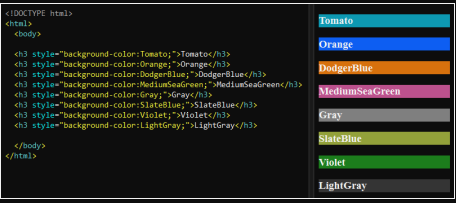

## Exercise 10: Basic Styling

**Objective:** Style various HTML elements using an external CSS file.

**Instructions:**
1. Create an HTML file named `basic-styling-page.html`.
2. Add a title: **"Basic Styling Examples"**.
3. Create a header (`<h1>`): **"Basic Styling"**.
4. Write a paragraph (`<p>`) that describes some styling features.
5. Create a list (`<ul>`) with three items using the `<li>` tag.
6. Style the header, paragraph, and list using an external CSS file called `styles.css`.
7. In the css file change the icon from `<li>` to disc
8. Save and open the file in a web browser.

go to: https://developer.mozilla.org/en-US/docs/Web/CSS/list-style-type
to define which icon you can use

### Contents of `basic-styling-page.html`
 
```html
<!DOCTYPE html>
<html lang="pt-BR">
<head>
    <meta charset="UTF-8">
    <meta name="viewport" content="width=device-width, initial-scale=1.0">
    <title>Basic Styling Examples</title>
    <link rel="stylesheet" href="styles.css"> <!--add external file-->
</head>
<body>
    <h1>Basic Styling</h1>
    <p>Learn how to style HTML elements using external CSS, such as:</p>
    <ul>
    <li>Change text colors</li>
    <li>Set font sizes</li>
    <li>Add margins and fillers</li>
    </ul>
</body>
</html>
```

-----------------------------------

## Exercise 11: Text Formatting

**Objective:**  Use various tags to format text, including bold, italic, and strong.

**Instructions:**

1. Create an HTML file named text-formatting-page.html.
2. Add a title: Text Formatting Examples.
3. Create a header (`<h1>`): "Text Formatting".
4. Write a paragraph (`<p>`) that includes:
5. A bold sentence using the (`<b>`) tag.
6. An italic sentence using the (`<i>`) tag.
7. A strong sentence using the (`<strong>`) tag.
8. Save and open the file in a web browser.
9. Contents of text-formatting-page.html


```html
<!DOCTYPE html>
<html lang="pt-BR">
<head>
    <meta charset="UTF-8">
    <meta name="viewport" content="width=device-width, initial-scale=1.0">
    <title>Text Formatting Examples</title>
    <link rel="stylesheet" href="styles.css">
</head>
<body>
    <h1>Text Formatting</h1>
    <p>
        Este texto é <b>negrito</b>, este texto é <i>itálico</i>, e este texto é <strong>forte</strong>.
    </p>
</body>
</html>
```

---------


## Exercise 12: Separate Html and CSS

**Objective:** Your mission is to separate these styles by organizing the CSS in an external file

**Instructions:**

You have been given an important task: the Front-End Architect of your website has noticed that the HTML file contains inline CSS, mixing the style rules directly into the code. Your mission is to separate these styles by organizing the CSS in an external file. Below is an image provided to help you get started.




------------------------


## Exercise 13: Implementação de Fontes com CSS

**Objective:** Aprender a incorporar fontes externas em um arquivo CSS utilizando @import ou @font-face.

**Instructions:**

1. Create a new project:
2. Create a new folder for the project and add an HTML file called index.html and a CSS file called styles.css.

**HTML file structure:**
3. In the index.html file, define a basic HTML structure. Insert some text sections, such as a heading (`<h1>`), a paragraph (`<p>`) and a list (`<ul>`).

**Adding Fonts in CSS:**
4. In the styles.css file, start by adding the following rule to import an external font using @import: css
5. search on google fonts and add the font

Below the font import, add CSS rules to apply the new font to HTML elements, such as the body of the page and headings. css

6. add 'Inter' to the body with sans-serif;
7. in the h1 set the font-weight: 700;
8. and in the paragraph, font-weight: 400;


```html
<!DOCTYPE html>
<html lang="pt-BR">
<head>
    <meta charset="UTF-8">
    <meta name="viewport" content="width=device-width, initial-scale=1.0">
    <title>Font Exercise</title>
    <link rel="stylesheet" href="styles.css">
</head>
<body>
    <h1>Font Implementation Exercise</h1>
    <p>Learn how to use external fonts in your CSS projects.</p>
</body>
</html>
```


------------------------
# Exercise 14: Basic Alignment

**Objective:** Learn how to use the CSS text-align properties to align text.

**Instructions:**
1. Create an HTML file called alignment-basic.html. 
2. Add the following basic structure to the file:

```html
<!DOCTYPE html>
<html lang="pt-BR">
<head>
    <meta charset="UTF-8">
    <meta name="viewport" content="width=device-width, initial-scale=1.0">
    <title>Basic Alignment</title>
    <link rel="stylesheet" href="styles.css">
</head>
<body>
    <h1>Text Alignment Example</h1>
    <p class="left">This paragraph is left-aligned.</p>
    <p class="center">This paragraph is centered.</p>
    <p class="right">This paragraph is right-aligned.</p>
</body>
</html>
```

3. Create a CSS file called styles.css and add the following rules, which are referenced in the paragraph class


------------------------

# Exercise 15: Solid Color Background

**Objective:** Learn how to apply a solid background color to an HTML page.

**Instructions:**

1. Create an HTML file called background-color.html. 
2. Add the following basic structure to the file:

```html
<!DOCTYPE html>
<html lang="pt-BR">
<head>
    <meta charset="UTF-8">
    <meta name="viewport" content="width=device-width, initial-scale=1.0">
    <title>Solid Color Background</title>
    <link rel="stylesheet" href="styles.css">
</head>
<body>
    <h1>Welcome to Solid Color Background!</h1>
    <p>This page has a solid color background.</p>
</body>
</html>
```

3. Create a CSS file called styles.css and add the following rule:

4. Place in the body

- background-color #3498DB; /* Blue background color */
- color: white; /* Text color */
- font-family: Arial, sans-serif; padding: 20px;

5. Open the background-color.html file in a browser and see the background color applied.

--- 

# Exercise 16: Background with Image

**Objective:** Learn how to apply an image as a background in an HTML page.

**Instructions:**

1. Create an HTML file called background-image.html. 
2. Add the following structure to the file:

```html
<!DOCTYPE html>
<html lang="pt-BR">
<head>
<meta charset="UTF-8">
<meta name="viewport" content="width=device-width, initial-scale=1.0">
<title>Background with Image</title>
<link rel="stylesheet" href="styles.css">
</head>
<body>
<h1>Welcome to Background with Image!</h1>
<p>This page has a background image.</p>
</body>
</html>
```

3. In the CSS file styles.css, add the following rule to apply a background image to the body:

- background-image: url('https://via.placeholder.com/1200x800'); /* URL of an image */
- background-size: cover; /* Makes the image cover the entire background */
- background-position: center; /* Centers the image */
- color: white; /* Text color */
- font-family: Arial, sans-serif;
- padding: 20px;

4. Open the background-image.html file in a browser and see the background image applied.


---

# Exercise 17: Gradient Background

**Objective:** Learn how to apply a gradient as a background in an HTML page.

**Instructions:**

1. Create an HTML file called background-gradient.html. 
2. Add the following structure to the file:

```html
<!DOCTYPE html>
<html lang="pt-BR">
<head>
    <meta charset="UTF-8">
    <meta name="viewport" content="width=device-width, initial-scale=1.0">
    <title>Gradient Background</title>
    <link rel="stylesheet" href="styles.css">
</head>
<body>
    <h1>Welcome to Gradient Background!</h1>
    <p>This page has a gradient background.</p>
</body>
</html>
```

3. In the CSS file styles.css, add the following rule to apply a gradient as the background to the body:

- background: linear-gradient(to right, #FF5733, #FFC300); /* Gradient from orange to yellow */
- color: white; /* Text color */
- font-family: Arial, sans-serif;
- padding: 20px;

4. Open the background-gradient.html file in a browser and see the background gradient applied.

--- 


# Exercise 18: Background with Multiple Images

**Objective:** Learn how to apply multiple images as background in an HTML page.

**Instructions:**

1. Create an HTML file called background-multiple.html. 
2. Add the following structure to the file:

```html
<!DOCTYPE html>
<html lang="pt-BR">
<head>
    <meta charset="UTF-8">
    <meta name="viewport" content="width=device-width, initial-scale=1.0">
    <title>Multiple Image Background</title>
    <link rel="stylesheet" href="styles.css">
</head>
<body>
    <h1>Welcome to Multiple Image Background!</h1>
    <p>This page has multiple background images.</p>
</body>
</html>
```

3. In the CSS file styles.css, add the following rule, body:

- background-image: url('https://www.calliaweb.co.uk/wp-content/uploads/2015/10/600x400.jpg'), url('https://www.calliaweb.co.uk/wp-content/uploads/2015/10/450x300.jpg'); /* Two images */
- background-size: 60%, 30%; /* Different sizes for the images */
- background-position: left top, right bottom; /* Different positions for the images */
- background-repeat: no-repeat; /* Do not repeat the images */
- color: white; /* Text color */
- font-family: Arial, sans-serif;
- padding: 20px;

4. Open the background-multiple.html file in a browser and see the multiple background images applied